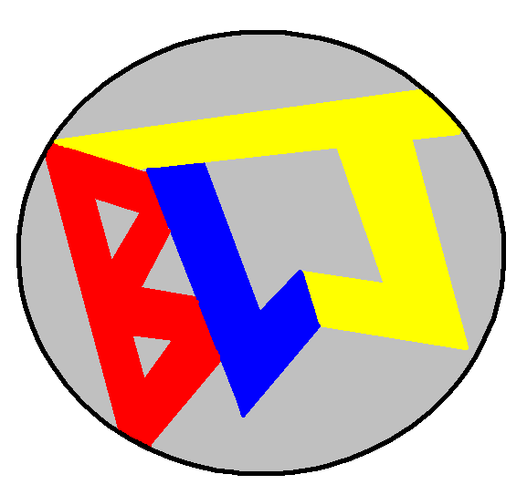
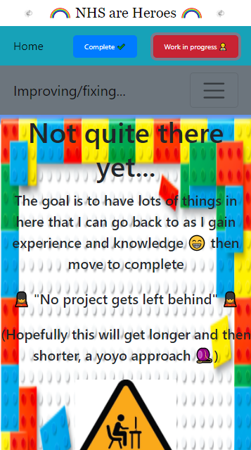

<!-- # Getting Started with Create React App

This project was bootstrapped with [Create React App](https://github.com/facebook/create-react-app).

## Available Scripts

In the project directory, you can run:

### `npm start`

Runs the app in the development mode.\
Open [http://localhost:3000](http://localhost:3000) to view it in the browser.

The page will reload if you make edits.\
You will also see any lint errors in the console.

### `npm test`

Launches the test runner in the interactive watch mode.\
See the section about [running tests](https://facebook.github.io/create-react-app/docs/running-tests) for more information.

### `npm run build`

Builds the app for production to the `build` folder.\
It correctly bundles React in production mode and optimizes the build for the best performance.

The build is minified and the filenames include the hashes.\
Your app is ready to be deployed!

See the section about [deployment](https://facebook.github.io/create-react-app/docs/deployment) for more information.

### `npm run eject`

**Note: this is a one-way operation. Once you `eject`, you can’t go back!**

If you aren’t satisfied with the build tool and configuration choices, you can `eject` at any time. This command will remove the single build dependency from your project.

Instead, it will copy all the configuration files and the transitive dependencies (webpack, Babel, ESLint, etc) right into your project so you have full control over them. All of the commands except `eject` will still work, but they will point to the copied scripts so you can tweak them. At this point you’re on your own.

You don’t have to ever use `eject`. The curated feature set is suitable for small and middle deployments, and you shouldn’t feel obligated to use this feature. However we understand that this tool wouldn’t be useful if you couldn’t customize it when you are ready for it.

## Learn More

You can learn more in the [Create React App documentation](https://facebook.github.io/create-react-app/docs/getting-started).

To learn React, check out the [React documentation](https://reactjs.org/).

### Code Splitting

This section has moved here: [https://facebook.github.io/create-react-app/docs/code-splitting](https://facebook.github.io/create-react-app/docs/code-splitting)

### Analyzing the Bundle Size

This section has moved here: [https://facebook.github.io/create-react-app/docs/analyzing-the-bundle-size](https://facebook.github.io/create-react-app/docs/analyzing-the-bundle-size)

### Making a Progressive Web App

This section has moved here: [https://facebook.github.io/create-react-app/docs/making-a-progressive-web-app](https://facebook.github.io/create-react-app/docs/making-a-progressive-web-app)

### Advanced Configuration

This section has moved here: [https://facebook.github.io/create-react-app/docs/advanced-configuration](https://facebook.github.io/create-react-app/docs/advanced-configuration)

### Deployment

This section has moved here: [https://facebook.github.io/create-react-app/docs/deployment](https://facebook.github.io/create-react-app/docs/deployment)

### `npm run build` fails to minify

This section has moved here: [https://facebook.github.io/create-react-app/docs/troubleshooting#npm-run-build-fails-to-minify](https://facebook.github.io/create-react-app/docs/troubleshooting#npm-run-build-fails-to-minify) -->

# Portfolio

## Becky Jones 

This is my portfolio.
  
I have separated it into different sections that can be navigated through the navbar (and buttons inside the navbar).

### Home

The home page just states a little bit about myself and has links to my github page (which if your reading this you are probably already on...) and also my linkedIn page.

<ul>
<li>Nicknames</li>
<li>Hobbies and Interests</li>
<li>Loves of my life</li>
</ul>
You could probably get alot of that from my github profile page....

###### (You can skip the home page)

### Complete ✔️

Complete button navigates you to a page were a navbar is located that can take you to the projects that I have completed.
<br 
Once on those pages it has information and pictures about the project. This may be about creating the project, the why or even how to maneuver around the projects site (getting to site is provided with a picture and a text link).
  
Although I don't think complete projects are genuinely "done" 😉

### Work in progress 👷

Work in progress button navigates you to a page were a navbar is located that can take you to the projects that are (as the name suggests) works in progress.
  
Once on those pages it has information and pictures about the project. This may be about creating the project, the why or even how to maneuver around the projects site (getting to site is provided with a picture and a text link).
  
The work may be that the projects have got some bugs, the projects themselves may decide when to work 😉 or even some css snags.
  
I have created the pages like this as I don't want to forget projects or give up on them, having them in an avaliable place I'm hoping 🤞 means that I can reflect on them.

## What I used 🛠️

For general app construction
  

<ul>
    <li>React </li>
        <ul>
        <li>React Dom</li>
        <li>React Router Dom</li>
    </ul>
 </ul>

For app navigation and additonal css
  

<ul>
    <li>Bootstrap </li>
</ul>
